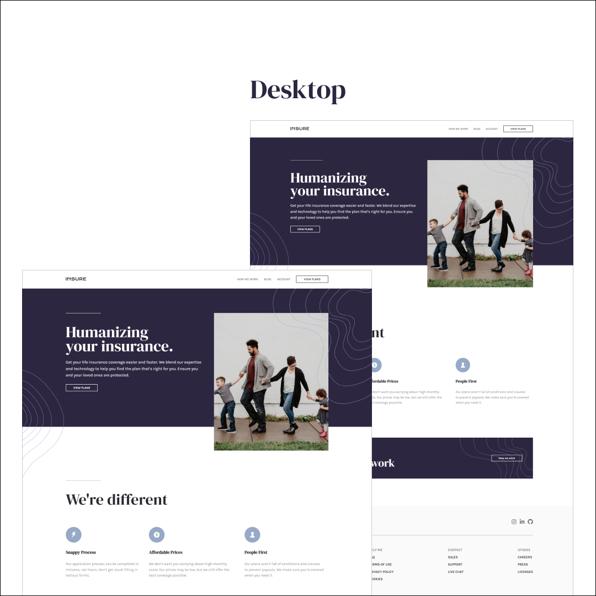
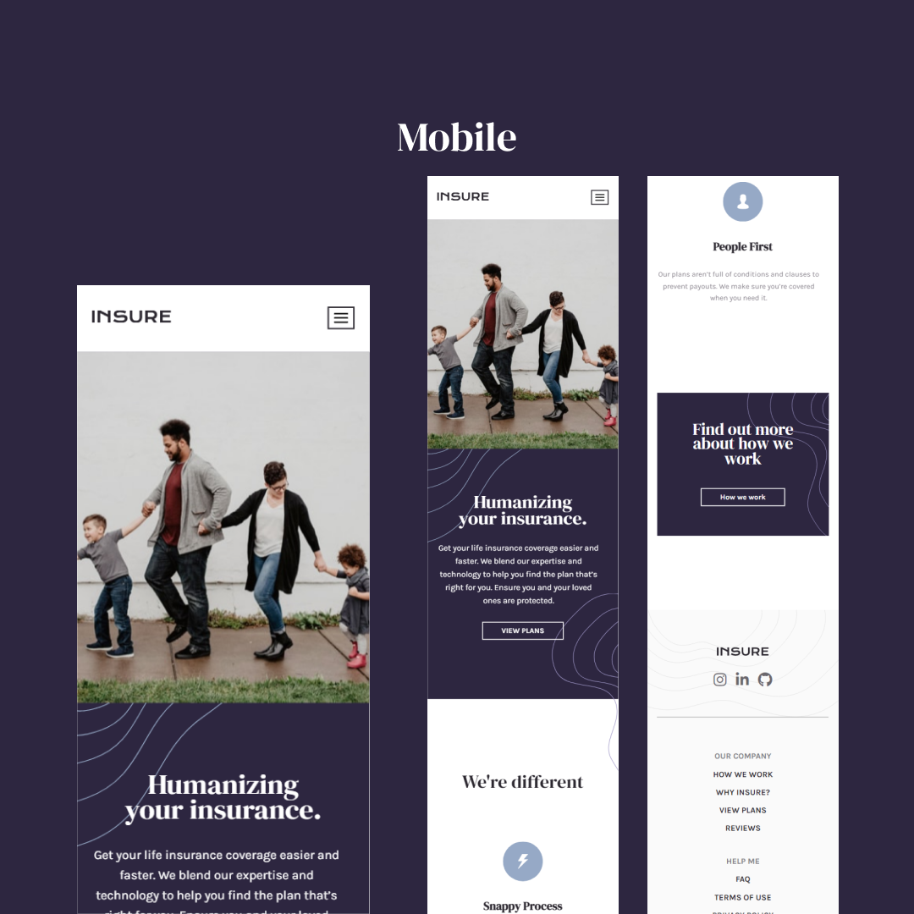

# Landing page Insure

uma Landing page 100% responsiva e com efeitos na rolagem da pagina.

## 🔨 Funcionalidades do projeto

O Insure tem como funcionalidade praticar alguns conseitos de HTML cemantico, CSS responsivo com flexbox e JS para dar um dinamismo maior no menu e na rolagem da pagina.

## ✔️ Técnicas e tecnologias utilizadas

- `HTML`: O HTML tem um papel fundamental para criar a estrutura do site;
- `CSS`: O CSS tem papel fundamental para implementar a responsividade e os estilos da pagina;
- `JavaScript`: O JavaScript proporcionará um meio de deixar o menu mobile mais intertivo e dinamico, nessa landing page tambem foi usada uma biblioteca chamada ScrollReveal que permite esse efeito de rolagem em poucas linhas de codigo, e no codigo trabalhamos com:
  - `querySelector`;
  - `document`;
  - `const`;
  - `function`;

## 📁 Acesso ao projeto

[Veja o projeto final](https://ornate-narwhal-abebdd.netlify.app/).

## 🛠️ Abrir e rodar o projeto

Para abrir e rodar o projeto, basta abrir o aquivo `index.html` no navegador.
